# Домашнее задание №8 (Тема "Настройка PostgreSQL")

Описание/Пошаговая инструкция выполнения домашнего задания:

* Развернуть виртуальную машину любым удобным способом
* Поставить на неё PostgreSQL 15 любым способом
  > 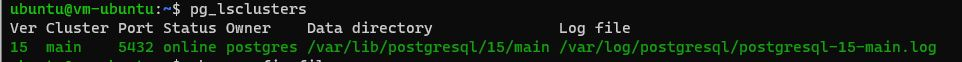
* Настроить кластер PostgreSQL 15 на максимальную производительность не обращая внимание на возможные проблемы с надежностью в случае аварийной перезагрузки виртуальной машины
  
 __*Перед тем, как настраивать кластер PostgreSQL на максимальную производительность, проверим утилитой pgbench, сколько выдает TPS:*__
  > 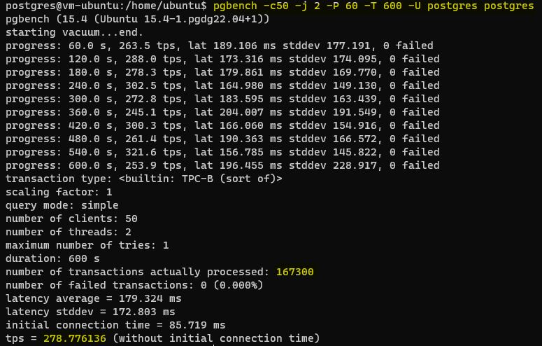
 __*-c 50 Количество моделируемых клиентов, т. е. количество одновременных сеансов базы данных.*__
 __*-j 2 Количество рабочих потоков, клиенты распределяются максимально равномерно по доступным потокам. Значение по умолчанию - 1.*__
 __*-P 60 Отображает отчет о ходе выполнения каждые 60 секунд.*__
 __*-T 600 Выполняет тест в течение этого количества секунд.*__
 __*-U postgres postgres Имя пользователя, к которому необходимо подключиться.*__  
 
 __*После этого начинаю настраивать кластер PostgreSQL на максимальную производительность, изменяя значения конфигурационных параметров.*__ 

 __*(1) Cделать создание точек восстановления раз в 59 минут, чтобы на время тестирования процесс создания точек восстановления не пересекался с создаваемой нагрузкой. Ранее значение параметра было 5 минут.*__
> 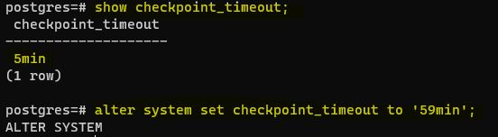

 __*(2) Параметр "wal_buffers", первоначально значение 4 МБ, зададим 16 МБ.*__
 > 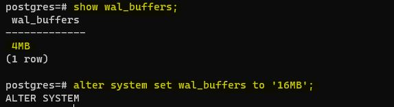

 __*(3) Параметр "max_wal_size", первоначально значение 1 ГБ, зададим 5 ГБ.*__
> 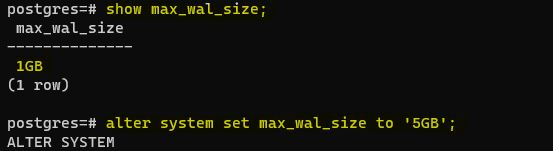

 __*(4) Параметр "min_wal_size", первоначально значение 80 МБ, зададим 1 ГБ.*__
> 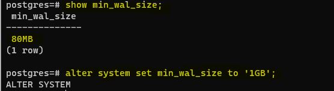

 __*(5) Параметр "work_mem", первоначально значение 4 МБ, зададим 16 МБ.*__
> 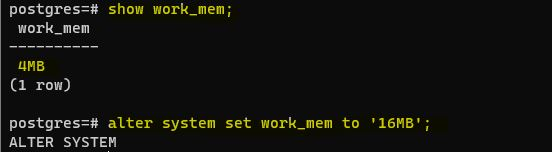

 __*(6) Параметр "shared_buffers", первоначально значение 128 МБ, зададим 1 ГБ.*__
> 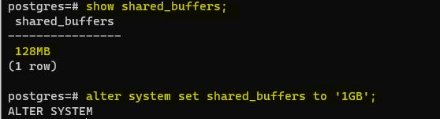

 __*(7) Параметр "maintenance_work_mem", первоначально значение 64 МБ, зададим 2 ГБ.*__
> 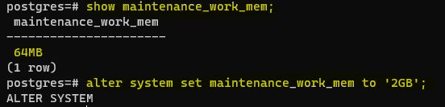

 __*(8) Параметр "Max_connections", первоначально значение 100, зададим 5.*__
> 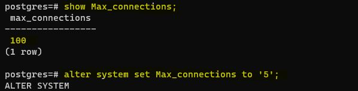

 __*(9) Параметр "effective_cache_size", первоначально значение 4 ГБ, зададим 15 ГБ.*__
> 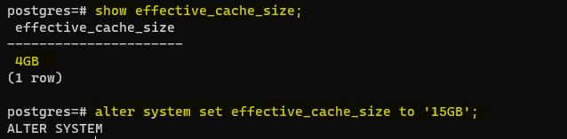

 __*Перезапускаю (pg_reload_conf), чтобы изменения применились.*__ 
 __*Смотрю в таблице "pg_file_settings" применились ли изменения - все применилось.*__
> 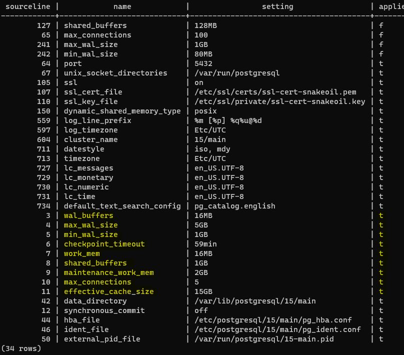

* Нагрузить кластер через утилиту через утилиту pgbench (https://postgrespro.ru/docs/postgrespro/14/pgbench)

 __*Снова утилитой pgbench выполняю нагрузку.*__
> 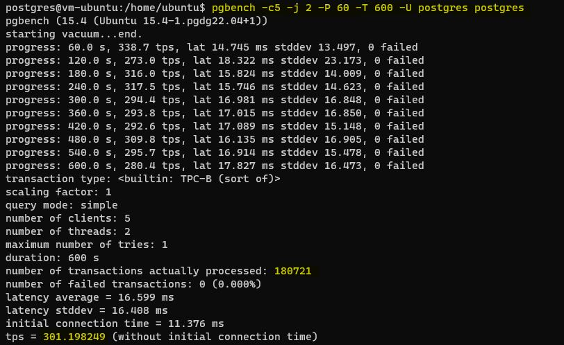

 __*В самом начале до настройки кластера TPS был равен 278.77 и число выполненных транзакций - 167300.*__
 __*После настройки кластера TPS равен 301.19 и число выполненных транзакций - 180721. То есть улучшения после переконфигурации кластера есть.*__ 
 __*И это при том, что в первом случае нагрузка осуществлялась с помощью 50 моделируемых клиентов, а во втором - 5.*__ 

 __*Можно еще увеличить TPS в разы, задав асинхронный режим записи в журнал.*__
 __*(10) Параметр "synchronous_commit", первоначально значение "on", зададим "off".*__
> 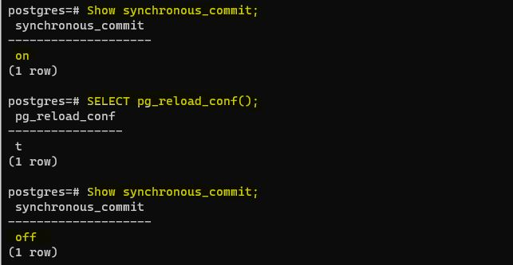

 __*Результат нагрузки в асинхронном режиме. TPS 2984.58, число выполненных транзакций 1790739.*__
> 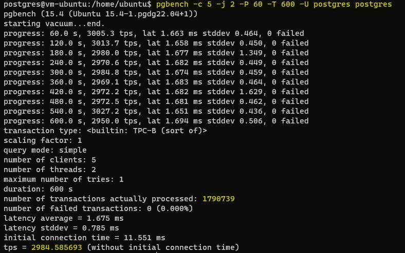

* 5 Написать какого значения tps удалось достичь, показать какие параметры в какие значения устанавливали и почему

 __*В первоначальной конфигурации кластера утилитой pgbench получили TPS 278.77.*__
 __*После настройки кластера в синхронном режиме TPS 301.19, в асинхронном режиме TPS 2984.58.*__ 

 __*(1) Параметр "checkpoint_timeout", первоначально значение 5 мин., задал 59 минут. Cделал так, чтобы создание точек восстановления не попало в момент работы утилиты pgbench. То есть не было нагрузки на диск.*__
 __*(2) Параметр "wal_buffers", первоначально значение 4 МБ, задал 16 МБ. Объём разделяемой памяти, который будет использоваться для буферизации данных WAL, ещё не записанных на диск. По документации значение параметра около 3% от shared_buffers, но не меньше чем 64 КБ и не больше чем размер одного сегмента WAL (обычно 16 МБ). Поставил максимально, чтобы увеличить буферизацию данных WAL, снизить количество обращений к диску для записи.*__
 __*(3) Параметр "max_wal_size", первоначально значение 1 ГБ, задал 5 ГБ. Контрольные точки производятся каждые "checkpoint_timeout" секунд либо при приближении к пределу max_wal_size, если это достигается раньше. Указав значение 5 ГБ, пытаюсь также отсрочить создание контрольных точек в момент тестирования, тем самым снизив нагрузку на дисковую подсистему.*__
 __*(4) Параметр "min_wal_size", первоначально значение 80 МБ, задал 1 ГБ. Значение "min_wal_size" ограничивает снизу число файлов WAL, которые будут переработаны для будущего использования. Я этот порог поднял, чтобы отсрочить этот процесс, на время тестирования.*__
 __*(5) Параметр "work_mem", первоначально значение 4 МБ, задал 16 МБ. Задаёт базовый максимальный объём памяти, который будет использоваться во внутренних операциях при обработке запросов (например, для сортировки или хеш-таблиц), прежде чем будут задействованы временные файлы на диске. Увеличив значение до 16 МБ я хочу тем самым минимизировать обращение к временным файлам на диске, так как это может замедлять выполнение запросов.*__
 __*(6) Параметр "shared_buffers", первоначально значение 128 МБ, задал 1 ГБ. Рекомендуемое значением shared_buffers 25% от объёма памяти. У нас 4 ГБ ОЗУ, по этому задал 1 ГБ. Чем больше "текущих" данных размещается в памяти, тем меньше идет обращений к базе данных, к диску.*__

 __*(7) Параметр "maintenance_work_mem", первоначально значение 64 МБ, задал 2 ГБ.*__
 __*(8) Параметр "Max_connections", первоначально значение 100, задал 5. Можно было этот параметр и не изменять, просто указав pgbench количесвто моделируемых клиентов 5.*__
 __*(9) Параметр "effective_cache_size", первоначально значение 4 ГБ, задал 15 ГБ.*__
 __*(10) Параметр "synchronous_commit", первоначально значение "on", задал "off". В синхронном режиме при фиксации транзакции продолжение работы невозможно до тех пор, пока все журнальные записи об этой транзакции не окажутся на диске. В асинхронном — транзакция завершается немедленно, а журнал записывается в фоновом режиме. То есть этим я уменьшил нагрузку на диск.*__
  

